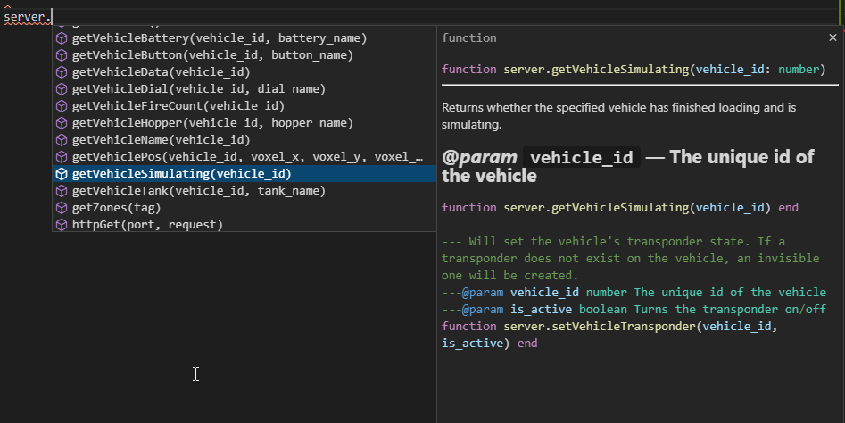

# StormworksLuaDocsGen

Generated based on data from https://docs.google.com/spreadsheets/d/1DkjUjX6DwCBt8IhA43NoYhtxk42_f6JXb-dfxOX9lgg/edit#gid=0

Currently requires you to copy the data from that Google doc into the `Files/Docs.xlsx` file (excluding the headers row and group column). Might make it read directly from the Google doc later.

## Usage

Made for [Visual Studio](https://code.visualstudio.com/) code with the [Lua extension](https://marketplace.visualstudio.com/items?itemName=sumneko.lua).

When editing a mission, open the mission's directory with VS Code via File -> Open Folder...  
Drop the [docs.lua from releases](https://github.com/Rene-Sackers/StormworksLuaDocsGen/releases/latest) file in the same directory as `script.lua`, and viola!

